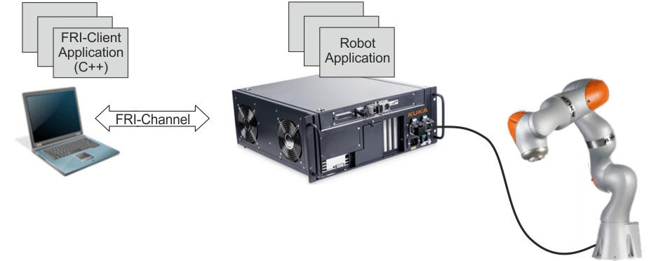

# iiwa_connectivity_fri_examples
 KUKA iiwa7 examples with Sunrise.Connectivity.FRI



## Requirements

- **Sunrise.Workbench 1.7** - Synchronization project with KRC
- **Sunrise.Connectivity.FRI 1.7** - Fast Robot Interface for iiwa 7
- **CMake** - Build the project


## Structure

```bash
—-- iiwa_connectivity_fri_examples/
  |--- libFRIClient/ # static library of FRIClient
     |--- doc/ # Html document
     |--- include/ # Headers for libFRIClient
     |--- src/ # Sources for libFRIClient
     |--- CMakeLists.txt # CMakeLists.txt to build libFRIClient
  |--- demo/ # examples of FRI
  	 |--- LBRClientTemplate/ # demo 1
  	 |--- LBRJointSineOverlay/ # demo 2
  	 |--- LBRTorqueSineOverlay/ # demo 3
  	 |--- LBRWrenchSineOverlay/ # demo 4
  	 |--- CMakeLists.txt # CMakeLists.txt to build demo
  |--- CMakeLists.txt # root CMakeList.txt
```

